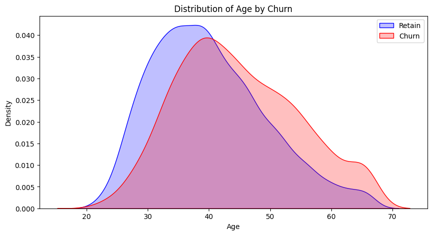

# CustomerChurnRate
A machine learning model to predict whether the customer will churn or not in the next six months.
Reducing Customer Churn is a major objective for any firm. An additional possible source of income for every firm is the ability to predict customer churn, commonly referred to as customer attrition. The cost to the firm is impacted by customer churn. Increased customer churn results in revenue loss and higher marketing expenses because it takes longer to acquire new consumers. 
As a data scientist of a bank, you are asked to analyze the past data and predict whether the customer will churn or not in the next 6 months. This would help the bank to have the right engagement with customers at the right time.

## Business Understanding

Customer churning, also known as customer attrition or customer defection, refers to the phenomenon where customers or clients discontinue their relationship with a company or business. In other words, it's the rate at which customers stop using a company's products or services and choose to go to a competitor or simply stop making purchases altogether. The business is a telecom company that provides internet and mobile services to its customers. The goal of The business is a telecommunications company that provides mobile and landline services to its customers.

Understanding the reasons for churn through data analysis and customer feedback is essential for implementing effective strategies to retain customers and build long-term relationships. In this challenge, as a data scientist of a bank, you are asked to analyze the past data and predict whether the customer will churn or not in the next 6 months. This would help the bank to have the right engagement with customers at the right time.

### 1.1 Business Objective

To predict if a customer will churn or not.

## Steps Performed
1. Loading and Understanding the data
2. Data Cleaning
3. Exploratory Data Analysis
4. Feature Engineering
5. Model Building
6. Model's Performance Comparison
7. Feature Importance
8. Conclusion
9. Recommendations

## Packages
1. Pandas
2. NumPY
3. Matplotlib
4. Seaborn
5. Plotly
6. Scikit-learn

## Age by Churn

## Gender Vs Churn

## Income Vs Churn

## Feature Importance

From the above representation Age and Vintage feature are the most effective features. The bank should focus on these features to reduce the churn rate. Also, the number of product holdings and whether a customer has a credit card contributes the least in target prediction.

## Receiver Operator Characteristic

### Deductions
- ROC-AUC curve shows the model performance by plotting the false positive rate to true positive rate.
- More the skewness of the curve towards the upper left corner higher is the area under the roc curve and better is the model performance.
- The Random Forest showed a tremendous performance but it is likely to overfit.
- Most of the models have achived around 65% accuracy.
- From the ROC-AUC curve it is clear that Logistic Regression performed poorly.

## Next Steps
- Trying other ensemble techniques like XGBoost and CatBoost might also help.
- Trying Deep Learning approach, training Artificial Neural Network.
- Experimenting with under-sampling to see whether there is any change in model performance.

